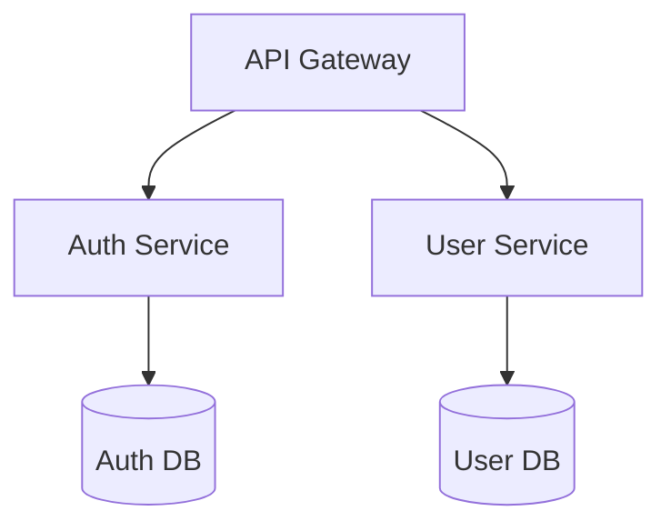

# Cursor AI: Revolutionary Features & Innovative Applications

*A comprehensive guide to Cursor AI's capabilities and the creative ways developers are transforming software development*

## 🚀 Introduction

Cursor AI represents a paradigm shift in software development tools. Built on top of Visual Studio Code, it enhances familiar workflows with cutting-edge AI capabilities, transforming the traditional coding experience into an intelligent, collaborative partnership between human creativity and artificial intelligence.

But Cursor's true power isn't just in its features—it's in how innovative developers are pushing it far beyond its intended use cases, creating sophisticated workflows that treat AI as a full development team member.

## 🧠 Core Revolutionary Features

### 1. **AI Agent Mode - Autonomous Task Completion**

The most groundbreaking feature of Cursor is its **Agent Mode**, which can autonomously complete entire programming tasks end-to-end.

**Key Capabilities:**
- Executes complex, multi-file operations independently
- Maintains transparency by keeping developers informed of progress
- Handles entire workflows from conception to implementation
- Operates within the Composer interface for seamless integration

**YOLO Mode Enhancement:**
- **Autonomous execution** where AI runs tests, sees failures, and iterates automatically
- **Terminal command execution** without asking for confirmation
- **Self-debugging cycles** that watch AI refine code in real-time
- **Continuous integration** with automated testing and validation

### 2. **Fusion Model for Intelligent Code Prediction**

Cursor's **Fusion Model** goes beyond traditional autocomplete by predicting both code content and navigation decisions.

**Features:**
- Suggests not just what to write, but where to go next
- Predicts multi-line code edits based on recent changes
- Anticipates cursor position for smoother navigation
- Offers contextual suggestions for API calls, error handling, and more

### 3. **Advanced Codebase Understanding & Context Management**

Unlike traditional editors, Cursor employs **custom retrieval models** to deeply understand entire codebases.

**Core Capabilities:**
- @Codebase feature for project-wide queries
- Intelligent context gathering without manual input
- Cross-file analysis and dependency understanding
- Smart symbol linking and definition discovery

**Innovative Context Management Systems:**
- **Status tracking files** (`status.md`) that preserve AI memory across sessions
- **Architectural documentation** that guides AI decision-making
- **Task management integration** that keeps AI focused on current priorities
- **Context restoration** techniques for overcoming token limits

### 4. **Composer - Multi-File AI Editing**

Revolutionary multi-file operations that enable complex operations across entire projects:

**Capabilities:**
- Edit multiple files simultaneously
- Generate complete applications from descriptions
- Understand project structure and dependencies
- Interactive refinement through chat interface

**Access:**
- **macOS:** ⌘I (Composer), ⌘⇧I (Full-screen)
- **Windows:** Ctrl+I (Composer), Ctrl+Shift+I (Full-screen)

## 🚀 Innovative Applications: Beyond Basic Coding

### 1. **Swarm Intelligence Development**

**Multi-Agent Parallel Development:**
The most cutting-edge approach involves creating "AI development swarms" using tools like:

- **file-forge**: Package entire projects into AI-digestible formats
- **Custom git worktree CLI tools**: Create multiple isolated Cursor instances
- **Parallel agent execution**: Each AI works on different features simultaneously
- **Automated branch management**: AI agents work independently then merge results

**Benefits:**
- Dramatically speeds up iteration by exploring multiple development paths at once
- Enables experimentation without conflicts
- Allows complex features to be developed in parallel

**Real-world Workflow:**
```bash
# Bundle project context
ffg --exclude github

# Generate development script via AI Studio
# Creates multiple worktrees automatically
# Each opens isolated Cursor instance

# Result: 5 AI agents working simultaneously on:
# - Authentication features
# - Database optimization  
# - UI components
# - Testing framework
# - Documentation
```

### 2. **Custom Agent Ecosystem Creation**

**Specialized AI Roles:**
Developers are creating sophisticated agent ecosystems with defined roles:

**Character-Based Development Teams:**
- **Project Manager Agent**: Focuses on planning and coordination
- **Architect Agent**: Handles system design and technical decisions  
- **Security Agent**: Dedicated to vulnerability scanning and secure coding
- **Testing Agent**: Specialized in test-driven development and quality assurance
- **Documentation Agent**: Focused on creating and maintaining docs
- **DevOps Agent**: Handles deployment and infrastructure concerns

**Implementation via Custom Agents:**
```json
// .cursor/modes.json example
{
  "architect": {
    "name": "System Architect",
    "model": "claude-3.7-sonnet", 
    "systemPrompt": "You are a senior system architect...",
    "tools": ["codebase", "documentation"]
  }
}
```

### 3. **Advanced Rule-Based Development Systems**

**Sophisticated .cursorrules Engineering:**

**Four Rule Types:**
- **Agent-selected rules**: AI chooses when to apply based on context
- **Always-applied rules**: Global project standards
- **Auto-selected rules**: File-pattern based automatic application
- **Manual rules**: Explicitly referenced when needed

**Innovative Rule Management:**
- **Auto-generating rules** based on project patterns and mistakes
- **Organic rule evolution**: Rules that adapt as codebase grows
- **Team-specific behavior**: Custom instructions ensuring consistency
- **Community rule sharing**: Industry-specific rule sets (fintech security, healthcare compliance)

**Example Advanced Rule Structure:**
```markdown
# .cursor/rules/core-rules/typescript-always.mdc
---
description: TypeScript development standards
globs: 
alwaysApply: true
---

# TypeScript Development Rules
- Use strict typing, avoid 'any'
- Follow SOLID principles  
- Write unit tests for all public methods
- Document with JSDoc
```

### 4. **Content Creation & Documentation**

**Beyond Coding Applications:**

**Technical Writing:**
- **Comprehensive documentation**: Auto-generated from codebase analysis
- **Blog post generation**: Technical content marketing
- **Tutorial creation**: Step-by-step guides with live code examples
- **API documentation**: Automatically maintained and updated

**Creative Applications:**
- **Presentation planning**: Structuring content and designing visuals
- **Copy optimization**: Audience-specific message crafting
- **Brand-consistent content**: On-brand image and copy generation
- **Educational materials**: Course content and learning resources

### 5. **Project Management & Planning**

**AI-Powered Workflow Management:**

**Strategic Planning:**
- **Project roadmaps**: AI-generated development timelines
- **Task breakdown**: Converting high-level features into actionable items
- **Progress tracking**: Automated status updates and milestone monitoring
- **Resource allocation**: Managing dependencies and team coordination

**Implementation Example:**
```markdown
# tasks/tasks.md structure
## USER-001: Implement Authentication
Status: In Progress
Priority: High
Dependencies: Database setup

### Acceptance Criteria
1. Users can register with email/password
2. JWT token generation on login
3. Rate limiting implementation
4. Security audit compliance
```

### 6. **Educational & Learning Applications**

**Knowledge Transfer:**

**Interactive Learning:**
- **Code explanation**: Deep analysis of complex algorithms
- **Architecture understanding**: Breaking down system designs  
- **Best practices teaching**: Learning through AI-guided refactoring
- **Technology exploration**: Safe experimentation with new frameworks

**Mentorship Applications:**
- **Junior developer training**: AI provides consistent code review
- **Onboarding automation**: New team member guidance
- **Skill development**: Personalized learning paths
- **Code quality improvement**: Real-time feedback and suggestions

### 7. **Advanced Development Methodologies**

**Cutting-Edge Approaches:**

**Test-Driven Development (TDD) with AI:**
```javascript
// AI writes failing tests first
describe('AuthService', () => {
  it('should handle SQL injection attempts')
  it('should prevent timing attacks') 
  it('should rate limit failed attempts')
})

// Then implements code to pass tests
// Ensures security and correctness
```

**Event-Driven Architecture:**
- **Complex system interactions**: AI understanding distributed systems
- **Microservices orchestration**: Managing service dependencies
- **Performance optimization**: AI-guided bottleneck identification
- **DevOps automation**: CI/CD pipeline optimization

### 8. **Multi-Tool Integration Workflows**

**Sophisticated Tool Orchestration:**

**AI Assistant Combinations:**
- **Cursor + Cline**: Running multiple AI assistants simultaneously
- **GitHub Copilot hybrid**: Different AI for different suggestion types
- **Specialized tools**: Security scanners, performance analyzers
- **Custom integrations**: MCP (Model Context Protocol) implementations

**Workflow Example:**
```bash
# Use Cursor for rapid development
# Cline for complex architectural changes  
# Copilot for quick autocomplete
# Custom agents for security review
```

### 9. **Business & Communication Applications**

**Professional Non-Coding Uses:**

**Decision-Making Frameworks:**
- **MBA-style analysis**: Comparison and evaluation tools
- **Timeline prediction**: Realistic project estimation based on data
- **Risk assessment**: Identifying potential project pitfalls
- **Strategic planning**: Long-term technology roadmaps

**Communication Excellence:**
- **Audience-specific messaging**: Tailored technical explanations
- **Stakeholder reports**: Automated progress summaries
- **Team coordination**: Meeting preparation and follow-up
- **Client communications**: Technical concepts for non-technical audiences

## 🎯 Latest Model Integrations (2025)

### **GPT-4.1 Integration**
- **Free access** to OpenAI's latest model
- **Million-token context window** (8x larger than previous models)
- **54.6% performance** on SWE-bench coding tests
- **Enhanced instruction following** and code comprehension

### **Multi-Model Support**
Current supported models include:
- **Claude 3.7 Sonnet** (most popular for complex reasoning)
- **Gemini 2.5 Pro** (excellent for code generation)
- **OpenAI o3 and o4-mini** (o4-mini available free)
- **GPT-4.1** (free access for limited time)
- **Cursor-optimized models** (cursor-fast, cursor-small)

## � Privacy and Security Features

### **Enterprise-Grade Security**
For sensitive enterprise and client work:
- **Privacy Mode**: Code never leaves your machine
- **Local AI processing**: Secure, on-device assistance
- **SOC 2 Certification**: Enterprise compliance standards
- **Secure environment options**: For regulated industries

## 💡 Innovative Workflow Patterns

### **Context Management Mastery**

**The Status File System:**
```markdown
# status.md - Project Memory
## Completed Features
- Authentication system with JWT
- Rate limiting implementation

## In Progress  
- OAuth integration (80% complete)
- Email verification system

## Blockers
- Third-party API rate limits
- Database migration pending
```

**Architecture-First Development:**


### **Rule-Based Consistency**

**Community Best Practices:**
- **Framework-specific rules**: React, Vue, Angular patterns
- **Security-first development**: Automatic vulnerability checks
- **Performance-oriented rules**: Optimization guidelines
- **Team coordination rules**: Consistent code style across developers

## 🚀 Getting Started with Innovative Workflows

### **Basic Setup**
1. **Install Cursor**: Visit [cursor.com](https://cursor.com)
2. **Configure Rules**: Set up `.cursorrules` for your project
3. **Document Architecture**: Create clear system diagrams
4. **Define Tasks**: Break down work into manageable chunks

### **Advanced Techniques**
1. **Enable YOLO Mode**: For autonomous development cycles
2. **Create Custom Agents**: Specialized AI roles for your team
3. **Implement Swarm Development**: Parallel AI development workflows
4. **Build Context Systems**: Memory and state management for AI

## 🔮 The Future of AI-Assisted Development

Cursor AI represents more than just a better code editor - it's pioneering a future where:

- **AI orchestrates entire development workflows** while humans focus on architecture and creativity
- **Natural language becomes a primary programming interface** alongside traditional code
- **Swarm intelligence enables massive parallel development** across complex systems
- **Context-aware AI remembers and learns** from every project interaction
- **Specialized AI agents handle domain-specific tasks** with expert-level knowledge

## 📚 Community Resources

### **Learning and Development**
- [Cursor Official Documentation](https://cursor.com/docs)
- [Cursor 101 - Learning Hub](https://cursor101.com)
- [Community Rules Repository](https://cursor.directory)
- [Awesome CursorRules](https://github.com/bmadcode/cursor-custom-agents-rules-generator)

### **Tools and Integrations**
- [File-Forge](https://www.npmjs.com/package/@johnlindquist/file-forge) - Project packaging
- [Worktree CLI](https://www.npmjs.com/package/@johnlindquist/worktree) - Multi-instance management
- [MCP Ecosystem](https://github.com/modelcontextprotocol) - Model Context Protocol tools

---

*Cursor AI is not just changing how we write code - it's revolutionizing how we think about software development itself. The innovative applications showcased here represent just the beginning of what's possible when human creativity meets AI capability.*

---

*Last Updated: January 2025*
*Document Version: 2.0 - Enhanced with Community Innovations*